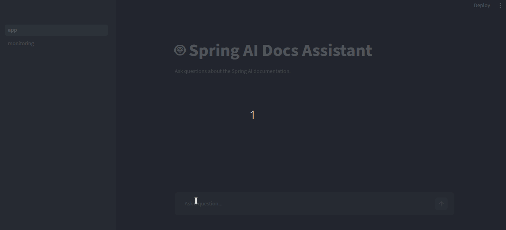
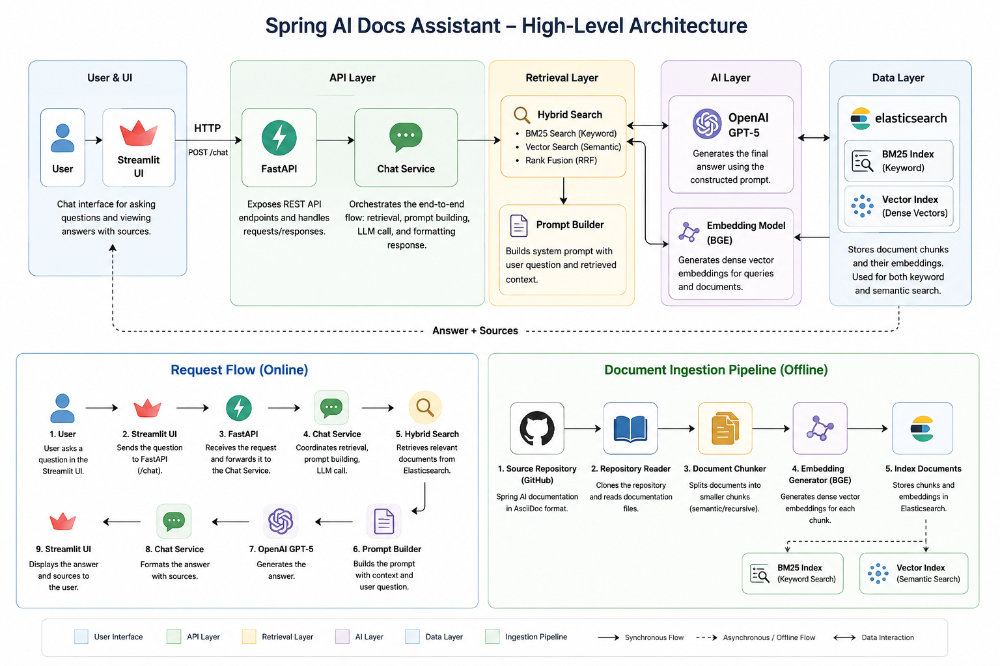

# 📚 Spring AI Docs Assistant

An AI-powered documentation assistant that enables natural language search and question answering over the Spring AI documentation using Retrieval-Augmented Generation (RAG).

The application ingests the official Spring AI documentation from GitHub, chunks and embeds the content, indexes it in Elasticsearch, and combines keyword and semantic search to retrieve the most relevant documentation. Retrieved context is then provided to an LLM to generate accurate, context-aware responses with source references.

## Demo

<p align="center">
  
</p>

## Features

- Hybrid retrieval using BM25 and vector search
- Automatic ingestion of Spring AI documentation from GitHub
- Document chunking and embedding generation
- Elasticsearch-backed document and vector index
- OpenAI GPT-powered question answering
- Streamlit chat interface
- Able to capture user feedback
- Streamlit metrics dashboard
- FastAPI REST API
- Docker Compose for local development
- Unit tests for core components

## Technology Stack

- Python 3.12
- FastAPI
- Streamlit
- Elasticsearch
- OpenAI GPT
- BAAI BGE Embedding Model
- Sentence Transformers
- Docker & Docker Compose

## High-Level Architecture

The application follows a Retrieval-Augmented Generation (RAG) architecture, combining hybrid search with a Large Language Model (LLM) to answer questions about the Spring AI documentation. The ingestion pipeline processes and indexes the documentation, while the request pipeline retrieves relevant context and generates grounded responses.



## Prerequisites

Before running the application, ensure you have the following installed:

- Docker
- Docker Compose
- An OpenAI API Key

---

## Setup

### 1. Create an environment file

Create a `.env` file in the project's root directory.

```properties
OPENAI_API_KEY=<your-openai-api-key>
```

### 2. Start the application

Build and start all services using Docker Compose:

```bash
docker compose up --build
```

> **Note**
> The first startup may take several minutes. During this time, the application:
>
> - Starts Elasticsearch
> - Downloads the embedding model
> - Clones the Spring AI repository
> - Chunks the documentation
> - Generates embeddings
> - Indexes all documents into Elasticsearch

### 3. Wait for startup to complete

The application is ready when the following banner appears in the logs: (It takes time to startup in first run)

```text
   _____ __             __
  / ___// /_____ ______/ /___  ______
  \__ \/ __/ __ `/ ___/ __/ / / / __ \
 ___/ / /_/ /_/ / /  / /_/ /_/ / /_/ /
/____/\__/\__,_/_/   \__/\__,_/ .___/
                              /_/

🚀 Spring AI Docs Assistant is Ready!
```

Once the startup is complete, you can access:

- **Streamlit UI:** http://localhost:8501
- **FastAPI Swagger UI:** http://localhost:8000/docs

## Test data (Queries)
- How do I configure memory in Spring AI?
- What is the purpose of the `@McpTool` annotation?
- What embedding models are supported?
- What is the weather looks like today? (negative)

> **Note**
> Make sure the following ports are available on your machine before starting the application:
>
> | Port | Service |
> |------|---------|
> | **8000** | FastAPI REST API |
> | **8501** | Streamlit UI |
> | **9200** | Elasticsearch |

